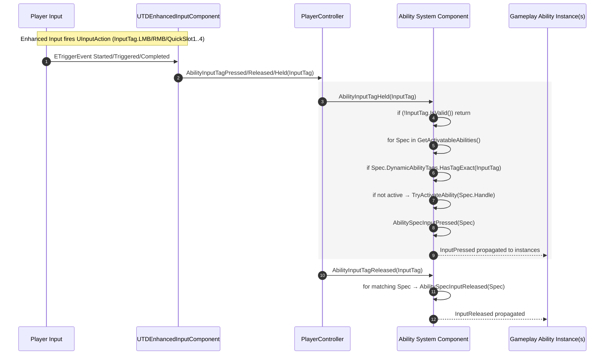

# Ability Input Tags and Activation Flow (ASC-centric)

Last updated: 2025-09-02

This guide covers how abilities are matched and activated by input tag, based on the AuraGameplayAbility and ASC patterns.

## Quick-reference diagram

Sequence view



Flowchart view

```mermaid
flowchart TD
    A[Player input (LMB/1–4)] --> B[Enhanced Input triggers UInputAction]
    B --> C[UTDEnhancedInputComponent<br>BindAbilityInputActions]
    C --> D[PlayerController callbacks<br>(Pressed/Held/Released with FGameplayTag)]
    D -->|Held| E[ASC.AbilityInputTagHeld(InputTag)]
    D -->|Released| F[ASC.AbilityInputTagReleased(InputTag)]
    E --> G{Spec.DynamicAbilityTags<br>HasTagExact(InputTag)?}
    G -->|No| H[Skip]
    G -->|Yes| I{Spec Active?}
    I -->|No| J[TryActivateAbility(Spec.Handle)]
    I -->|Yes| K[Already Active]
    J --> L[AbilitySpecInputPressed(Spec)]
    K --> L
    F --> M[AbilitySpecInputReleased(Spec)]
    L --> N[Ability instance(s): InputPressed]
    M --> O[Ability instance(s): InputReleased]
```

## Startup Input Tag on AuraGameplayAbility

- Add a public UPROPERTY(EditDefaultsOnly, Category=Input) FGameplayTag StartupInputTag to your AuraGameplayAbility subclass.
- Set StartupInputTag on the CDO (class defaults) or in a derived BP.
- This value is for initial mapping when abilities are granted at game start.

## Add StartupInputTag to the AbilitySpec (dynamic tags)

When granting startup abilities in your Ability System Component (ASC):
- Create the FGameplayAbilitySpec for the ability.
- If the underlying ability is an AuraGameplayAbility and StartupInputTag is valid, add it to Spec.DynamicAbilityTags.
- Use dynamic tags so you can remap inputs at runtime (remove one tag, add another) without touching the ability class.

Pseudo-code sketch:

```cpp
for (FGameplayAbilitySpec& Spec : StartupSpecs)
{
    if (const UAuraGameplayAbility* AuraGA = Cast<UAuraGameplayAbility>(Spec.Ability))
    {
        if (AuraGA->StartupInputTag.IsValid())
        {
            Spec.DynamicAbilityTags.AddTag(AuraGA->StartupInputTag);
        }
    }
    GiveAbility(Spec);
}
```

## Handling input in the ASC

Implement two methods on your ASC and call them from your PlayerController's Held/Released callbacks:

- AbilityInputTagHeld(const FGameplayTag& InputTag)
- AbilityInputTagReleased(const FGameplayTag& InputTag)

Key steps (Held):
- if (!InputTag.IsValid()) return;  // note the negation
- Iterate GetActivatableAbilities()
- For each Spec with Spec.DynamicAbilityTags.HasTagExact(InputTag):
  - If not active: TryActivateAbility(Spec.Handle)
  - Signal input pressed each tick while held: AbilitySpecInputPressed(Spec)

Key steps (Released):
- if (!InputTag.IsValid()) return;
- Iterate GetActivatableAbilities()
- For each Spec with Spec.DynamicAbilityTags.HasTagExact(InputTag):
  - Signal input released: AbilitySpecInputReleased(Spec)

Notes:
- TryActivateAbility respects cooldowns/costs and may fail; that's expected.
- Input pressed/released toggles an internal flag and forwards to ability instances (override InputPressed/InputReleased in your abilities as needed).
- Do not forcibly end abilities on release unless that's your design; let each ability decide.

## PlayerController integration recap

- Three callbacks receive FGameplayTag and forward to ASC (Held/Released), optional behavior on Pressed.
- Cache ASC via UAbilitySystemBlueprintLibrary::GetAbilitySystemComponent(GetPawn()) to avoid per-frame casts.

## Debugging tips

- Use on-screen debug messages to confirm tags.
- Inspect ActivatableAbilities during a breakpoint to verify your StartupInputTag is present in Spec.DynamicAbilityTags.
- If abilities re-activate every frame, ensure they aren't ending instantly (try adding a small duration) or adjust Held behavior.

## Runtime remapping

- To remap keys at runtime, remove the current InputTag from a Spec's DynamicAbilityTags and add a different InputTag. Your Held/Released routing will naturally follow the new tag.

## Common pitfalls

- Validity guard must be: if (!InputTag.IsValid()) return;
- IMC not applied/active → no callbacks fire
- Default Input Component Class not set → binding fails
- Tag name mismatch vs centralized tags → no matches