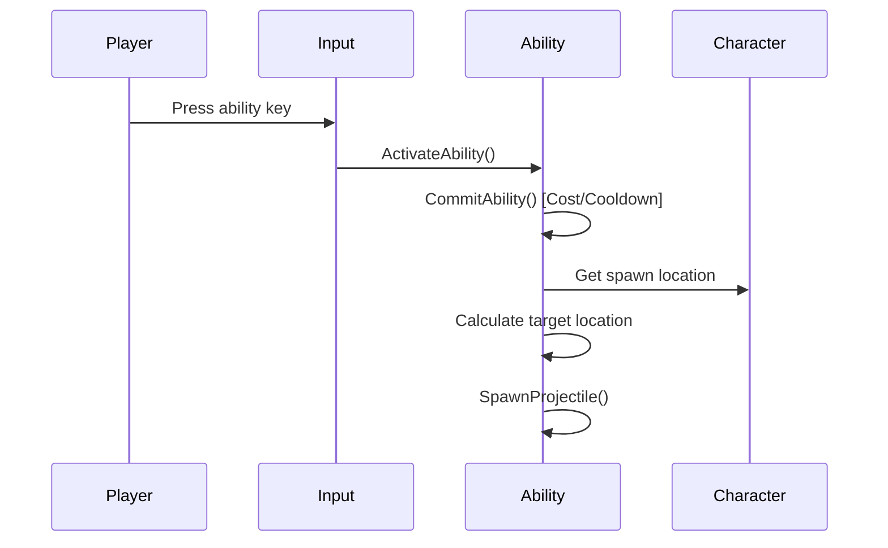
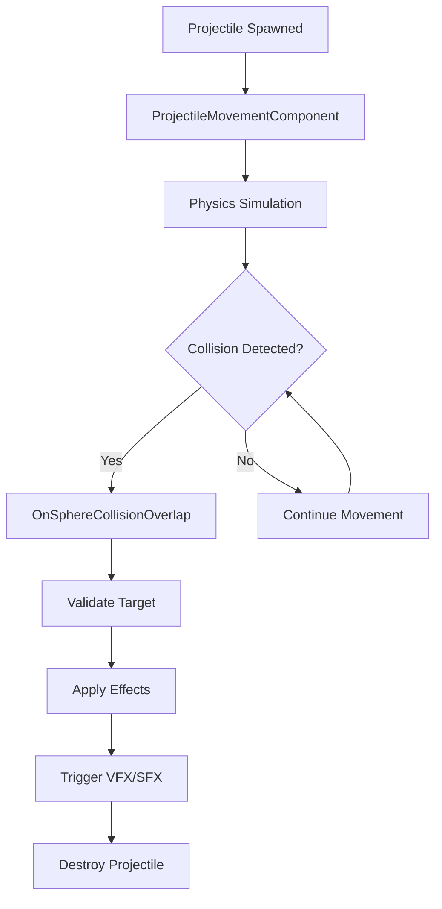

# Projectile System Overview

Last updated: 2024-12-19

## Introduction

The GAS-RPG-TopDown projectile system provides a comprehensive framework for creating spell-based and ranged combat mechanics. It integrates seamlessly with the Gameplay Ability System (GAS) to deliver performant, networked projectile gameplay with rich customization options.

## System Architecture

### Core Components

The projectile system consists of several interconnected components:

```
┌─────────────────────────────────────────────────────────────┐
│                    Projectile System                        │
├─────────────────────────────────────────────────────────────┤
│  ┌─────────────────┐  ┌──────────────────┐  ┌─────────────┐ │
│  │ Ability Layer   │  │  Actor Layer     │  │ Integration │ │
│  │                 │  │                  │  │             │ │
│  │ • ProjectileBase│  │ • GASCoreProj... │  │ • Combat... │ │
│  │ • TargetingModes│  │ • TDProjectile...│  │ • Character │ │
│  │ • InputHandling │  │ • Movement       │  │ • Effects   │ │
│  │ • Validation    │  │ • Collision      │  │ • UI/VFX    │ │
│  └─────────────────┘  └──────────────────┘  └─────────────┘ │
└─────────────────────────────────────────────────────────────┘
```

### Component Responsibilities

| Component | Purpose | Key Features |
|-----------|---------|--------------|
| **Ability Layer** | Handles projectile spawning logic, targeting, and integration with GAS | Input validation, cost/cooldown, targeting modes |
| **Actor Layer** | Manages projectile movement, collision, and visual effects | Physics simulation, collision detection, VFX spawning |
| **Integration Layer** | Connects projectiles to game systems | Combat interface, character integration, effect application |

## Key Classes and Relationships

### Class Hierarchy

```cpp
// Base projectile actor (GASCore Plugin)
AGASCoreProjectileActor : AActor
    ├── Components: USceneComponent, USphereComponent, UProjectileMovementComponent
    ├── Methods: OnSphereCollisionOverlap(), BeginPlay()
    └── Purpose: Foundation for all projectile types

// Game-specific projectile (RPG_TopDown Project)  
ATDProjectileActor : AGASCoreProjectileActor
    ├── Inherits: All base functionality
    ├── Extends: Game-specific collision handling, effect application
    └── Purpose: Project-specific projectile behavior

// Base ability class (GASCore Plugin)
UGASCoreGameplayAbility : UGameplayAbility
    ├── Properties: StartupInputTag
    ├── Purpose: Foundation for all game abilities
    └── Extensions: Input handling, tag management

// Projectile ability pattern (Conceptual)
UProjectileAbilityBase : UGASCoreGameplayAbility
    ├── Properties: ProjectileClass, targeting configuration
    ├── Methods: SpawnProjectile(), CalculateTargetLocation()
    └── Purpose: Template for projectile-based abilities

// Character integration
ATDCharacterBase : ACharacter, IAbilitySystemInterface, IGASCoreCombatInterface
    ├── Components: ASC, AttributeSet, AbilityInitComponent
    ├── Methods: InitializeAbilityActorInfo(), GetActorLevel()
    └── Purpose: Foundation for characters that can use projectile abilities
```

## Projectile Lifecycle

### 1. Ability Activation



### 2. Projectile Spawning

```cpp
// Simplified projectile spawning flow
void UProjectileAbility::SpawnProjectile(const FVector& Start, const FVector& Target)
{
    // Server authority check
    if (!HasAuthority()) return;
    
    // Calculate direction and rotation
    FVector Direction = (Target - Start).GetSafeNormal();
    FRotator SpawnRotation = Direction.Rotation();
    
    // Configure spawn parameters
    FActorSpawnParameters SpawnParams;
    SpawnParams.Owner = GetAvatarActorFromActorInfo();
    SpawnParams.Instigator = Cast<APawn>(GetAvatarActorFromActorInfo());
    SpawnParams.SpawnCollisionHandlingOverride = ESpawnActorCollisionHandlingMethod::AlwaysSpawn;
    
    // Spawn projectile actor
    AActor* Projectile = GetWorld()->SpawnActor<ATDProjectileActor>(
        ProjectileClass, Start, SpawnRotation, SpawnParams);
    
    // Configure projectile properties
    if (ATDProjectileActor* TDProjectile = Cast<ATDProjectileActor>(Projectile))
    {
        TDProjectile->SetAbilityContext(GetAbilityContext());
        TDProjectile->SetDamageEffectClass(DamageEffect);
    }
}
```

### 3. Movement and Collision



### 4. Effect Application

```cpp
void ATDProjectileActor::OnSphereCollisionOverlap(/*params*/)
{
    // Validate collision target
    if (!IsValidTarget(OtherActor)) return;
    
    // Get target's Ability System Component
    UAbilitySystemComponent* TargetASC = UAbilitySystemBlueprintLibrary::GetAbilitySystemComponent(OtherActor);
    if (!TargetASC) return;
    
    // Apply damage effect
    if (DamageEffectClass)
    {
        FGameplayEffectContextHandle EffectContext = TargetASC->MakeEffectContext();
        EffectContext.AddSourceObject(this);
        EffectContext.AddInstigator(GetInstigator(), this);
        
        FGameplayEffectSpecHandle EffectSpec = TargetASC->MakeOutgoingSpec(
            DamageEffectClass, 1.0f, EffectContext);
        
        if (EffectSpec.IsValid())
        {
            TargetASC->ApplyGameplayEffectSpecToSelf(*EffectSpec.Data.Get());
        }
    }
    
    // Trigger impact effects
    SpawnImpactEffects(SweepResult.ImpactPoint);
    
    // Destroy projectile
    Destroy();
}
```

## Targeting System

### Targeting Modes

The projectile system supports multiple targeting approaches:

| Mode | Description | Use Case | Implementation |
|------|-------------|----------|----------------|
| **Cursor Location** | Target mouse cursor position | Player-controlled spells | Raycast from camera to cursor |
| **Closest Enemy** | Auto-target nearest hostile | Auto-attack abilities | Sphere overlap + distance sort |
| **Forward Direction** | Fire straight ahead | Directional attacks | Character forward vector |
| **Specific Actor** | Target predetermined actor | Guided missiles | Reference to target actor |
| **Movement Direction** | Fire in movement direction | Kiting abilities | Last movement input vector |

### Targeting Implementation

```cpp
FVector UProjectileAbility::CalculateTargetLocation() const
{
    switch (TargetingMode)
    {
        case EProjectileTargetingMode::CursorLocation:
            return GetCursorTargetLocation();
            
        case EProjectileTargetingMode::ClosestEnemy:
            return GetClosestEnemyLocation();
            
        case EProjectileTargetingMode::ForwardDirection:
            {
                FVector Forward = GetAvatarActorFromActorInfo()->GetActorForwardVector();
                FVector Start = CalculateSpawnLocation();
                return Start + (Forward * MaxRange);
            }
            
        case EProjectileTargetingMode::SpecificActor:
            return TargetActor ? TargetActor->GetActorLocation() : FVector::ZeroVector;
            
        default:
            return FVector::ZeroVector;
    }
}
```

## Network Architecture

### Authority Model

The projectile system follows Unreal Engine's standard authority model:

- **Server Authority:** Only server spawns authoritative projectiles
- **Client Prediction:** Clients may spawn visual-only projectiles for responsiveness
- **Replication:** Projectile movement replicated via UProjectileMovementComponent
- **Effect Application:** All gameplay effects applied server-side only

### Network Optimization

```cpp
class GASCORE_API AGASCoreProjectileActor : public AActor
{
    GENERATED_BODY()

public:
    AGASCoreProjectileActor()
    {
        // Optimize for network performance
        PrimaryActorTick.bCanEverTick = false;        // No tick needed
        bReplicates = true;                           // Enable replication
        SetReplicatingMovement(false);                // Movement handled by component
        
        // Projectile movement handles its own replication
        ProjectileMovementComponent->SetIsReplicated(true);
    }
    
    // Custom replication
    virtual void GetLifetimeReplicatedProps(TArray<FLifetimeProperty>& OutLifetimeProps) const override
    {
        Super::GetLifetimeReplicatedProps(OutLifetimeProps);
        
        // Replicate essential properties only
        DOREPLIFETIME_CONDITION(AGASCoreProjectileActor, ProjectileData, COND_InitialOnly);
    }
};
```

## Performance Considerations

### Optimization Strategies

1. **Object Pooling**
   ```cpp
   class UProjectilePool : public USubsystem
   {
       // Pool management for frequently spawned projectiles
       AGASCoreProjectileActor* GetProjectile(TSubclassOf<AGASCoreProjectileActor> Class);
       void ReturnProjectile(AGASCoreProjectileActor* Projectile);
   };
   ```

2. **Automatic Cleanup**
   ```cpp
   void AGASCoreProjectileActor::BeginPlay()
   {
       Super::BeginPlay();
       
       // Auto-destroy after maximum lifetime
       SetLifeSpan(MaxLifetime);
   }
   ```

3. **Collision Optimization**
   ```cpp
   // Minimal collision channels for performance
   SphereCollision->SetCollisionEnabled(ECollisionEnabled::QueryOnly);
   SphereCollision->SetCollisionResponseToAllChannels(ECR_Ignore);
   SphereCollision->SetCollisionResponseToChannel(ECC_Pawn, ECR_Overlap);
   ```

### Performance Metrics

| Metric | Target | Monitoring |
|--------|--------|------------|
| Projectiles/frame | < 50 active | UE4 Stat System |
| Memory usage | < 1MB per 100 projectiles | Memory profiler |
| Network bandwidth | < 1KB/s per projectile | Network profiler |
| Frame time impact | < 0.1ms per projectile | UE4 Insights |

## Integration Examples

### Firebolt Spell Implementation

```cpp
UCLASS(BlueprintType, Blueprintable)
class RPG_TOPDOWN_API UFireboltAbility : public UProjectileAbilityBase
{
    GENERATED_BODY()

public:
    UFireboltAbility()
    {
        // Configure ability properties
        AbilityTags.AddTag(FGameplayTag::RequestGameplayTag("Ability.Offensive.Firebolt"));
        ActivationOwnedTags.AddTag(FGameplayTag::RequestGameplayTag("State.Casting"));
        
        // Configure projectile
        ProjectileClass = ATDFireboltProjectile::StaticClass();
        ProjectileSpeed = 800.f;
        MaxRange = 1500.f;
        TargetingMode = EProjectileTargetingMode::CursorLocation;
        
        // Configure costs
        CostGameplayEffectClass = UManaCostEffect::StaticClass();
        CooldownGameplayEffectClass = UFireboltCooldownEffect::StaticClass();
    }

protected:
    virtual void ActivateAbility(/*params*/) override
    {
        if (!CommitAbility(/*params*/))
        {
            EndAbility(/*params*/, true, true);
            return;
        }
        
        // Play casting animation
        PlayMontageAndWait(CastingMontage);
        
        // Spawn projectile after cast time
        FTimerHandle CastTimer;
        GetWorld()->GetTimerManager().SetTimer(CastTimer, [this]()
        {
            FVector SpawnLoc = CalculateSpawnLocation();
            FVector TargetLoc = CalculateTargetLocation();
            SpawnProjectile(SpawnLoc, TargetLoc);
            
            EndAbility(/*params*/, true, false);
        }, CastTime, false);
    }
};
```

### Multi-Shot Ability

```cpp
UCLASS()
class RPG_TOPDOWN_API UMultiShotAbility : public UProjectileAbilityBase
{
    GENERATED_BODY()

protected:
    UPROPERTY(EditDefaultsOnly, Category = "Multi-Shot")
    int32 ProjectileCount = 3;
    
    UPROPERTY(EditDefaultsOnly, Category = "Multi-Shot")
    float SpreadAngle = 30.f;

    virtual void ActivateAbility(/*params*/) override
    {
        if (!CommitAbility(/*params*/)) return;
        
        FVector SpawnLocation = CalculateSpawnLocation();
        FVector BaseDirection = CalculateTargetDirection();
        
        // Spawn multiple projectiles with spread
        for (int32 i = 0; i < ProjectileCount; i++)
        {
            float AngleOffset = FMath::Lerp(-SpreadAngle/2.f, SpreadAngle/2.f, 
                (float)i / FMath::Max(1, ProjectileCount - 1));
            
            FRotator SpreadRotation = BaseDirection.Rotation();
            SpreadRotation.Yaw += AngleOffset;
            
            FVector TargetLocation = SpawnLocation + (SpreadRotation.Vector() * MaxRange);
            SpawnProjectile(SpawnLocation, TargetLocation);
        }
        
        EndAbility(/*params*/, true, false);
    }
};
```

## Debugging and Development Tools

### Visual Debugging

```cpp
// Console variables for debugging
TAutoConsoleVariable<bool> CVarProjectileDebugDraw(
    TEXT("projectile.DebugDraw"),
    false,
    TEXT("Enable projectile trajectory visualization"));

TAutoConsoleVariable<bool> CVarProjectileDebugLog(
    TEXT("projectile.DebugLog"),
    false,
    TEXT("Enable projectile debug logging"));

// Debug drawing in projectile ability
void UProjectileAbility::DebugDrawTrajectory(const FVector& Start, const FVector& End)
{
    if (CVarProjectileDebugDraw.GetValueOnGameThread())
    {
        UWorld* World = GetWorld();
        DrawDebugLine(World, Start, End, FColor::Red, false, 3.f, 0, 2.f);
        DrawDebugSphere(World, Start, 10.f, 12, FColor::Green, false, 3.f);
        DrawDebugSphere(World, End, 15.f, 12, FColor::Blue, false, 3.f);
    }
}
```

### Performance Profiling

```cpp
// Built-in profiling support
DECLARE_CYCLE_STAT(TEXT("Projectile Spawn"), STAT_ProjectileSpawn, STATGROUP_Game);
DECLARE_CYCLE_STAT(TEXT("Projectile Collision"), STAT_ProjectileCollision, STATGROUP_Game);

void UProjectileAbility::SpawnProjectile(/*params*/)
{
    SCOPE_CYCLE_COUNTER(STAT_ProjectileSpawn);
    // Spawning logic...
}

void ATDProjectileActor::OnSphereCollisionOverlap(/*params*/)
{
    SCOPE_CYCLE_COUNTER(STAT_ProjectileCollision);
    // Collision logic...
}
```

### Console Commands

```cpp
// Useful console commands for testing
UFUNCTION(Exec, Category = "Projectile Debug")
void SpawnTestProjectile(float Speed = 800.f, float Range = 1000.f);

UFUNCTION(Exec, Category = "Projectile Debug")
void ClearAllProjectiles();

UFUNCTION(Exec, Category = "Projectile Debug")
void ProjectileStress(int32 Count = 10);
```

## Best Practices

### Design Guidelines

1. **Separation of Concerns**
   - Keep projectile actors focused on movement and collision
   - Handle game logic in ability classes
   - Use interfaces for system integration

2. **Performance First**
   - Disable tick on projectile actors
   - Use object pooling for frequently spawned projectiles
   - Implement automatic cleanup and lifetime management

3. **Network Friendly**
   - Server-authoritative effect application
   - Minimal data replication
   - Client prediction for visual responsiveness

4. **Designer Friendly**
   - Data-driven configuration through Blueprint inheritance
   - Clear parameter names and categories
   - Comprehensive debugging tools

### Common Pitfalls

| Problem | Cause | Solution |
|---------|-------|----------|
| Projectiles spawn inside character | Improper spawn offset | Use character bounds + safety margin |
| Collision not detected | Wrong collision channels | Configure collision response properly |
| Performance drops with many projectiles | No pooling/cleanup | Implement object pooling and lifetime limits |
| Network desync | Client-side effect application | Server-only gameplay effect application |
| Projectiles miss moving targets | Static targeting | Implement predictive targeting |

## Future Extensions

### Planned Features

1. **Advanced Targeting**
   - Predictive targeting for moving targets
   - Lock-on targeting system
   - Area-of-effect targeting

2. **Projectile Types**
   - Homing projectiles
   - Bouncing projectiles  
   - Chain lightning projectiles
   - Explosive projectiles

3. **Visual Enhancements**
   - Trail effects system
   - Impact effect framework
   - Projectile deformation

4. **Gameplay Features**
   - Projectile deflection/reflection
   - Projectile interception
   - Projectile-projectile collision

## See Also

- [Projectile Actors Documentation](projectile-actors.md)
- [Projectile Abilities Pattern](projectile-abilities.md)
- [Character Base Implementation](../architecture/character-base.md)
- [Combat Interface](combat-interface.md)
- [GAS Integration Guide](../gas/abilities/overview.md)
- [Performance Optimization](../architecture/performance.md)